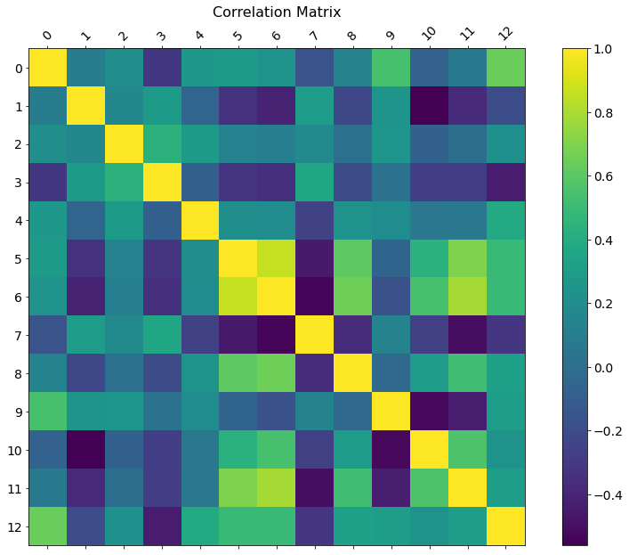
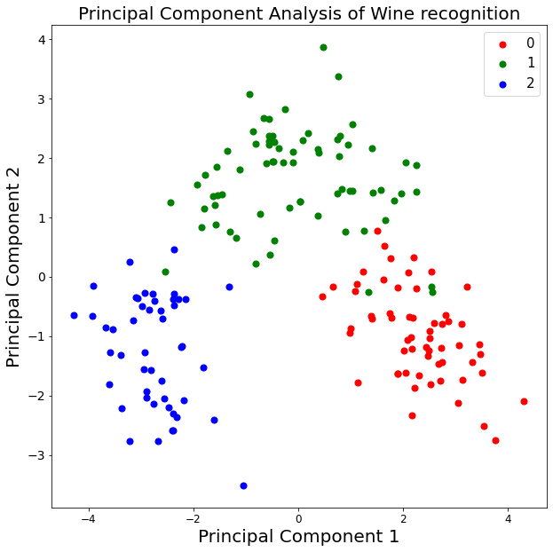
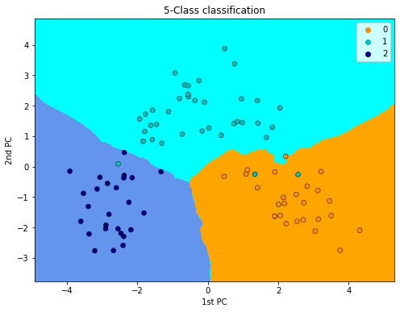

# Wine Recognition Using K-NN Methods

This project involves a chemical analysis of wines samples from Italy from three different cultivators, focusing on thirteen different attributes. The goal is to predict the class of wine based on these attributes using K-Nearest Neighbors (K-NN) methods.





## Table of Contents
- [METHODS](#methods)
- [RESULTS](#results-and-conclusion)
- [REFERENCES](#references)
- [Images](#images)

## Methods

We utilize Principal Component Analysis (PCA) to reduce dimensionality, focusing on the first two principal components. Consequently, we apply the K-NN method with varying values of $K =(3, 5, 7)$ to classify the wines. The used loss function is the $0-1$ loss, with accuracy as the primary performance metric.

Data is split into training, validation, and test sets using proportions of 60%, 20%, and 20%, respectively.



## Results and Conclusion
$K = 3$ was found to be the most effective model based on training and validation accuracies.
The test accuracy for $K = 3$ was $0.9545$, indicating high performance.
Future work could explore other loss functions and clustering approaches.


## References
UCI ML Wine Recognition Dataset: Wine Dataset


## Images

This directory contains some images used in the final report ```report.pdf```